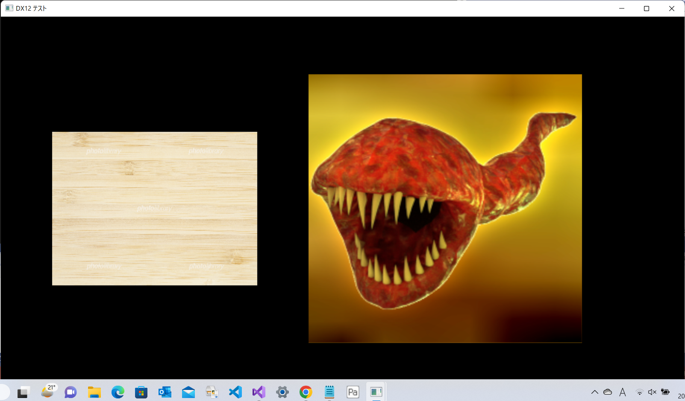
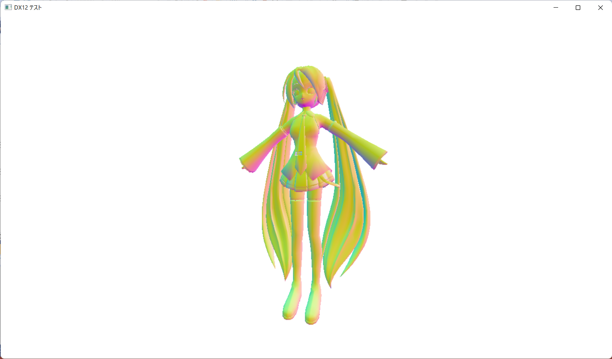
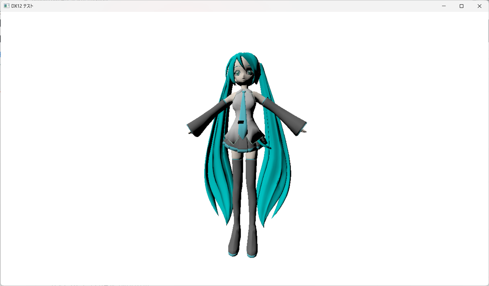
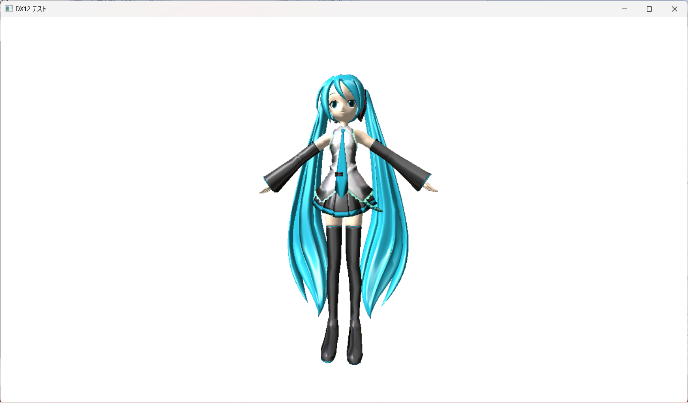
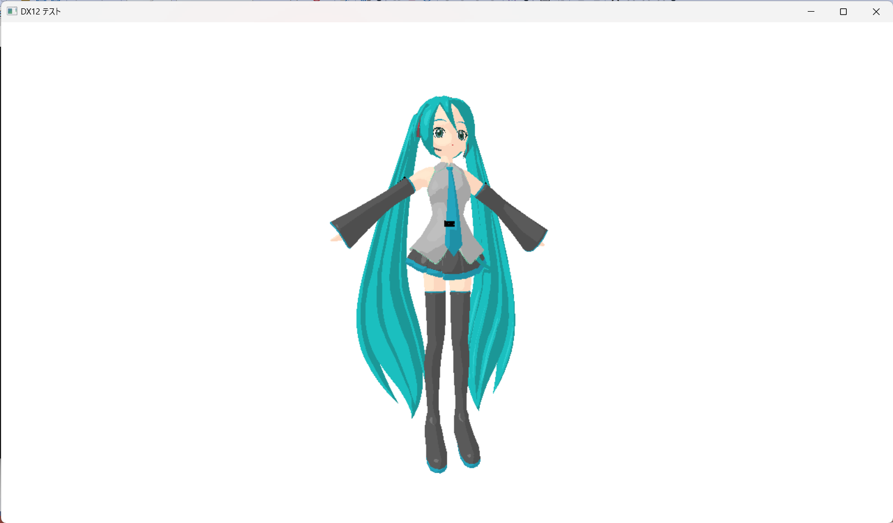

# これは何？
プログラムワークショップ4の管理用

# 使い方

- 本リポジトリ(tpu-game-2022/PGWS4)をforkしてください。
- fork先のリポジトリを更新してください
- 完成したら本リポジトリのmainブランチにpull requestを投げてください

# 第6回課題

# 第8回進捗

# 第9回進捗

# 第10回進捗

# 第11回進捗

# 第12回進捗

# 締め切り
次の授業の2日前（水曜日の授業であれば月曜日一杯）

